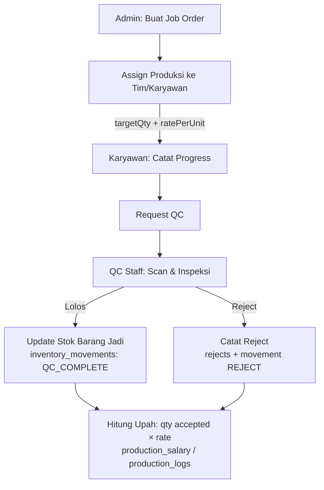
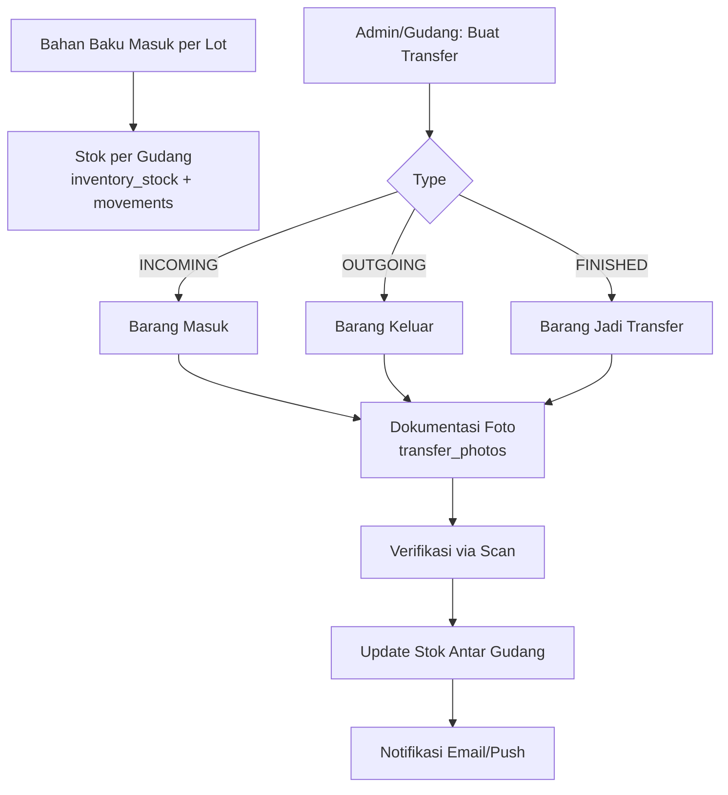
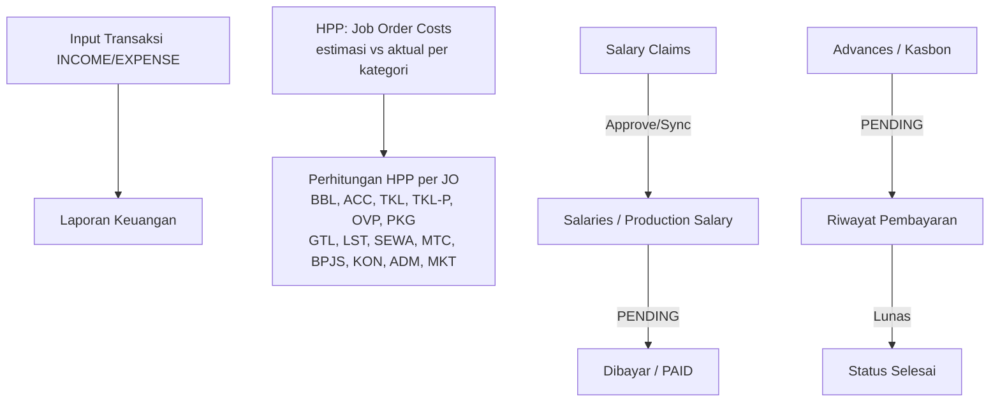
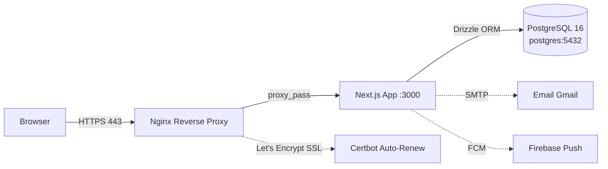
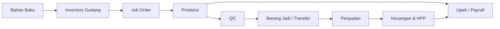

# App Flowchart — ERP Konveksi (Mini Konveksi App)

Berikut flowchart alur utama aplikasi dalam format Mermaid.

## 1. Autentikasi & RBAC

```mermaid
flowchart TD
  Start[Landing Page /] -->|Sign In| SignIn[Sign-In via Email/Password]
  Start -->|Login PIN| PinLogin[Login PIN Karyawan]

  SignIn -->|Success| CheckRole{Deteksi Role}
  PinLogin --> CheckRole

  CheckRole -->|SUPERADMIN/ADMIN| AdminDash[/dashboard/admin]
  CheckRole -->|GUDANG| GudangDash[/dashboard/gudang]
  CheckRole -->|QC| QCDash[/dashboard/qc]
  CheckRole -->|KARYAWAN| KaryawanDash[/dashboard/karyawan]

  CheckRole -->|Akses route lain| Middleware{Middleware: canAccess?}
  Middleware -->|Tidak diizinkan| Redirect[Redirect ke dashboard role]
  Middleware -->|Diizinkan| Route[Akses Halaman]

  SignIn -->|Gagal| SignIn
  Route -.- Auth[Session cookie - Better Auth]
```

## 2. Alur Produksi (Inti)



## 3. Inventory & Transfer



## 4. Alur Keuangan & Payroll



## 5. Service & Infrastruktur (Deployment)



## 6. Ringkasan Siklus Bisnis End-to-End

